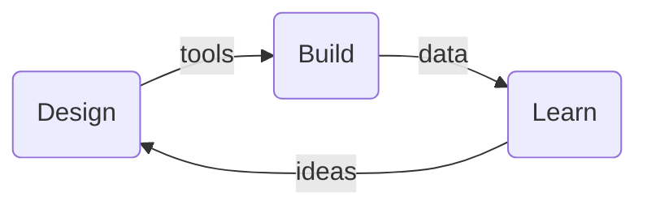

  😄Hi! Welcome to share Metabolic Engineering and Computational Biology information with me.

```mermaid
graph LR
A(Design) -->|tools| B(Build)
B(Build) -->|data| C(Learn)
C(Learn) -->|ideas| A(Design)
```

$For$ $Better$ $Synthetic$ $Biology$

